# AvailAI Data Model

```mermaid
erDiagram
    %% ─── AUTH ───────────────────────────────────────────
    User {
        int id PK
        string email UK
        string name
        string role "buyer|sales|trader|manager|admin"
        string azure_id UK
        bool is_active
    }

    %% ─── CRM ────────────────────────────────────────────
    Company {
        int id PK
        string name
        string domain
        string industry
        string account_type "Customer|Prospect|Partner|Competitor"
        int account_owner_id FK
        string sf_account_id UK
        json brand_tags
        json commodity_tags
    }

    CustomerSite {
        int id PK
        int company_id FK
        int owner_id FK
        string site_name
        string site_type "HQ|Branch|Warehouse|Manufacturing"
        string contact_name
        string contact_email
    }

    SiteContact {
        int id PK
        int customer_site_id FK
        string full_name
        string email
        string title
        string contact_status
    }

    %% ─── SOURCING PIPELINE ──────────────────────────────
    Requisition {
        int id PK
        string name
        string status "active|open|archived|closed"
        int customer_site_id FK
        int created_by FK
        string customer_name
        datetime deadline
    }

    Requirement {
        int id PK
        int requisition_id FK
        int material_card_id FK
        string primary_mpn
        string normalized_mpn
        int target_qty
        decimal target_price
        json substitutes
    }

    Sighting {
        int id PK
        int requirement_id FK
        int material_card_id FK
        int source_company_id FK
        string vendor_name
        string vendor_name_normalized
        string mpn_matched
        string normalized_mpn
        int qty_available
        decimal unit_price
        string source_type
        float score
        bool is_unavailable
    }

    Offer {
        int id PK
        int requisition_id FK
        int requirement_id FK
        int material_card_id FK
        int vendor_card_id FK
        int entered_by_id FK
        string vendor_name
        string vendor_name_normalized
        string mpn
        string normalized_mpn
        int qty_available
        decimal unit_price
        string status "active|sold"
        string source
    }

    Contact {
        int id PK
        int requisition_id FK
        int user_id FK
        string vendor_name
        string contact_type
        string status "sent|responded|error"
        string graph_message_id
    }

    VendorResponse {
        int id PK
        int contact_id FK
        int requisition_id FK
        string vendor_email
        json parsed_data
        float confidence
        string classification
        string match_method
    }

    %% ─── MATERIAL INTELLIGENCE ──────────────────────────
    MaterialCard {
        int id PK
        string normalized_mpn UK
        string display_mpn
        string manufacturer
        string lifecycle_status "active|nrfnd|eol|obsolete|ltb"
        string category
        tsvector search_vector
        datetime deleted_at
    }

    MaterialVendorHistory {
        int id PK
        int material_card_id FK
        string vendor_name
        string vendor_name_normalized
        int times_seen
        decimal last_price
        string source_type
    }

    MaterialCardAudit {
        int id PK
        int material_card_id
        string action "created|linked|unlinked|deleted|merged"
        string entity_type
        int entity_id
    }

    %% ─── VENDOR INTELLIGENCE ────────────────────────────
    VendorCard {
        int id PK
        string normalized_name UK
        string display_name
        string domain
        float engagement_score
        float vendor_score
        json brand_tags
        json commodity_tags
        int sighting_count
        tsvector search_vector
    }

    VendorContact {
        int id PK
        int vendor_card_id FK
        string full_name
        string email
        string title
        float relationship_score
        string activity_trend "warming|stable|cooling|dormant"
    }

    VendorReview {
        int id PK
        int vendor_card_id FK
        int user_id FK
        int rating
        string comment
    }

    %% ─── QUOTES & BUY PLANS ────────────────────────────
    Quote {
        int id PK
        int requisition_id FK
        int customer_site_id FK
        int created_by_id FK
        string quote_number UK
        json line_items
        decimal subtotal
        decimal total_margin_pct
        string status "draft|sent|won|lost"
    }

    BuyPlan {
        int id PK
        int requisition_id FK
        int quote_id FK
        int submitted_by_id FK
        int approved_by_id FK
        string status "draft|pending_approval|approved|complete|rejected|cancelled"
        json line_items
        string sales_order_number
    }

    %% ─── PROACTIVE MATCHING ────────────────────────────
    ProactiveMatch {
        int id PK
        int offer_id FK
        int requirement_id FK
        int customer_site_id FK
        int salesperson_id FK
        int material_card_id FK
        string mpn
        int match_score
        string status "new|sent|dismissed|converted"
    }

    ProactiveOffer {
        int id PK
        int customer_site_id FK
        int salesperson_id FK
        json line_items
        string status "sent|converted"
        string graph_message_id
    }

    CustomerPartHistory {
        int id PK
        int company_id FK
        int material_card_id FK
        string mpn
        int purchase_count
        decimal last_unit_price
        string source "salesforce_import|avail_offer|avail_quote_won"
    }

    %% ─── PROSPECTING ───────────────────────────────────
    ProspectAccount {
        int id PK
        string name
        string domain UK
        string industry
        int fit_score
        int readiness_score
        json readiness_signals
        string status "suggested|claimed|dismissed|converted"
        string discovery_source
        int claimed_by FK
        int company_id FK
    }

    DiscoveryBatch {
        int id PK
        string batch_id UK
        string source "clay|explorium"
        string status "running|completed|error"
        int prospects_found
        int prospects_new
    }

    %% ─── ENRICHMENT ────────────────────────────────────
    EnrichmentQueue {
        int id PK
        int vendor_card_id FK
        int company_id FK
        string enrichment_type
        string field_name
        text proposed_value
        float confidence
        string status "pending|approved|rejected|applied"
    }

    ProspectContact {
        int id PK
        int customer_site_id FK
        int vendor_card_id FK
        string full_name
        string email
        string source
    }

    %% ─── PERFORMANCE ───────────────────────────────────
    VendorMetricsSnapshot {
        int id PK
        int vendor_card_id FK
        date snapshot_date
        float composite_score
        float response_rate
        float on_time_delivery
    }

    BuyerLeaderboardSnapshot {
        int id PK
        int user_id FK
        date month
        int total_points
        int rank
    }

    %% ─── SYSTEM ────────────────────────────────────────
    ActivityLog {
        int id PK
        int user_id FK
        string activity_type "call|email|meeting|note"
        int company_id FK
        int vendor_card_id FK
        int requisition_id FK
    }

    %% ═══ RELATIONSHIPS ═════════════════════════════════

    User ||--o{ Requisition : creates
    User ||--o{ Contact : sends
    User ||--o{ Quote : creates
    User ||--o{ BuyPlan : submits
    User ||--o{ VendorReview : writes
    User ||--o{ BuyerLeaderboardSnapshot : scored
    User ||--o{ ActivityLog : performs

    Company ||--o{ CustomerSite : has
    Company ||--o{ CustomerPartHistory : purchased
    User ||--o{ Company : "owns (account_owner)"

    CustomerSite ||--o{ SiteContact : has
    CustomerSite ||--o{ Requisition : sourcing-for
    CustomerSite ||--o{ Quote : quoted-to
    CustomerSite ||--o{ ProactiveMatch : matched-to
    CustomerSite ||--o{ ProactiveOffer : offered-to
    User ||--o{ CustomerSite : "owns (site)"

    Requisition ||--o{ Requirement : contains
    Requisition ||--o{ Offer : receives
    Requisition ||--o{ Contact : "RFQ outreach"
    Requisition ||--o{ Quote : quoted-as

    Requirement ||--o{ Sighting : "search results"
    Requirement ||--o{ Offer : "vendor quotes"
    Requirement }o--|| MaterialCard : "links to"

    Sighting }o--|| MaterialCard : "links to"
    Sighting }o--o| Company : "source (excess list)"

    Offer }o--|| MaterialCard : "links to"
    Offer }o--o| VendorCard : "from vendor"
    Offer ||--o{ ProactiveMatch : "matched to customer"

    MaterialCard ||--o{ MaterialVendorHistory : "vendor history"
    MaterialCard ||--o{ CustomerPartHistory : "purchase history"
    MaterialCard ||--o{ MaterialCardAudit : audited

    VendorCard ||--o{ VendorContact : employs
    VendorCard ||--o{ VendorReview : reviewed
    VendorCard ||--o{ MaterialVendorHistory : "carries parts"
    VendorCard ||--o{ VendorMetricsSnapshot : "daily metrics"
    VendorCard ||--o{ EnrichmentQueue : "pending enrichment"

    Contact ||--o{ VendorResponse : "replies parsed"

    Quote ||--o{ BuyPlan : "purchase plan"

    ProspectAccount }o--o| DiscoveryBatch : "discovered in"
    ProspectAccount }o--o| User : "claimed by"
    ProspectAccount }o--o| Company : "converted to"

    Company ||--o{ EnrichmentQueue : "pending enrichment"
```



## Data Flow Summary

```
┌─────────────────────────────────────────────────────────────────────┐
│                        SOURCING PIPELINE                            │
│                                                                     │
│  User creates Requisition                                           │
│       └── with Requirements (MPNs + qty + target price)             │
│              │                                                      │
│              ├── Search → Sightings (scored results from APIs)      │
│              │                └── linked to MaterialCard             │
│              │                └── linked to VendorCard (normalized)  │
│              │                                                      │
│              ├── RFQ → Contacts (email outreach via Graph API)      │
│              │           └── VendorResponses (AI-parsed replies)     │
│              │                                                      │
│              └── Offers (confirmed vendor quotes)                   │
│                     └── linked to MaterialCard + VendorCard          │
│                                                                     │
│  Sales builds Quote (selected Offers → line items for customer)     │
│       └── BuyPlan (approved → PO numbers → complete)                │
└─────────────────────────────────────────────────────────────────────┘

┌─────────────────────────────────────────────────────────────────────┐
│                      PROACTIVE MATCHING                             │
│                                                                     │
│  New Offer arrives                                                  │
│       └── match against archived Requirements (same MPN)            │
│              └── check CustomerPartHistory (bought before?)         │
│                     └── ProactiveMatch (scored, assigned to sales)  │
│                            └── ProactiveOffer (email to customer)   │
│                                   └── ProactiveThrottle (rate limit)│
└─────────────────────────────────────────────────────────────────────┘

┌─────────────────────────────────────────────────────────────────────┐
│                        PROSPECTING                                  │
│                                                                     │
│  DiscoveryBatch (Explorium/Clay/Email mining)                       │
│       └── ProspectAccount (scored: fit + readiness)                 │
│              ├── Warm intro detection (VendorCard/SiteContact match) │
│              ├── Similar customer matching (Company comparison)      │
│              ├── AI writeup generation                               │
│              └── Claim → Convert to Company + CustomerSite           │
└─────────────────────────────────────────────────────────────────────┘

┌─────────────────────────────────────────────────────────────────────┐
│                     DEDUPLICATION KEYS                               │
│                                                                     │
│  Parts:   normalized_mpn  ─── links Requirement ↔ Sighting ↔ Offer  │
│                                      ↔ MaterialCard ↔ CPH           │
│                                                                     │
│  Vendors: vendor_name_normalized ─── links Sighting ↔ Offer ↔       │
│                                      Contact ↔ MVH → VendorCard     │
│                                                                     │
│  Domains: company.domain / vendor_card.domain / prospect.domain     │
│           ─── cross-reference for warm intros + enrichment          │
└─────────────────────────────────────────────────────────────────────┘
```
