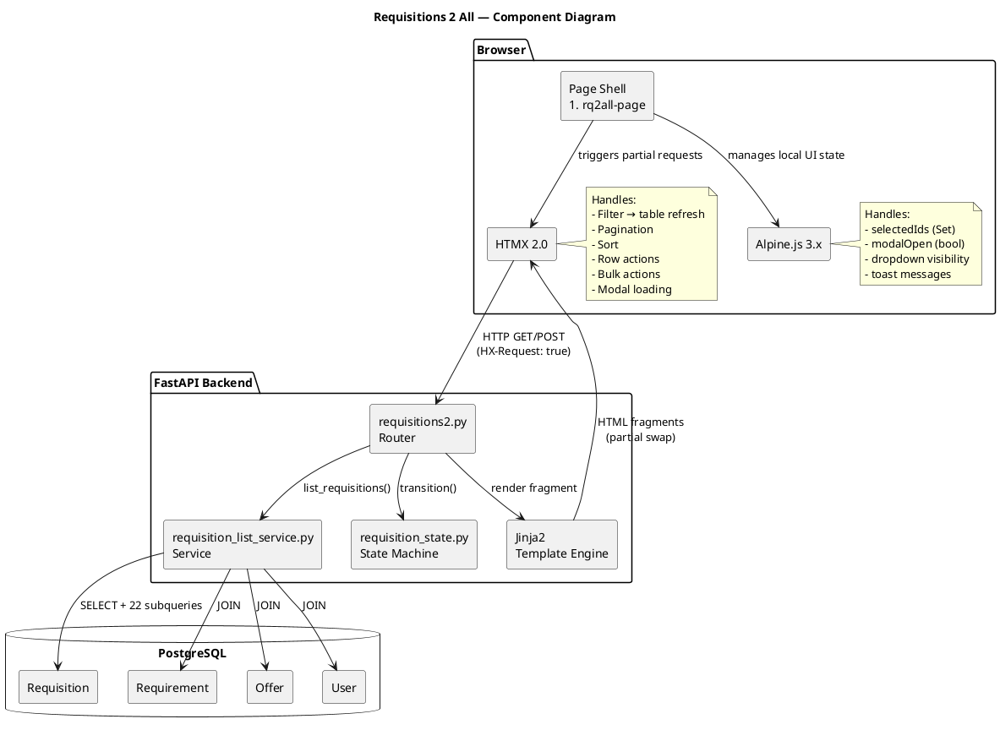

# Requisitions 2 All — HTMX Migration Execution Plan

**Project**: AvailAI — Trio Supply Chain Solutions
**Target page**: Requisitions list ("Requisitions 2 All")
**Date**: 2026-03-12
**Status**: Draft — ready for contractor implementation

---

## PHASE 1 — DISCOVERY

### Current Coupling Problems

The existing requisitions page lives inside a monolithic architecture with these problems:

1. **954KB shared `app.js`** — All requisition logic lives in a single JavaScript file shared with every other page. Functions like `loadRequisitions()`, `goToReq()`, `expandToSubTab()`, `batchArchive()`, `batchAssign()`, `claimRequisition()` etc. are global functions in one massive namespace.

2. **Client-side caching of server state** — `_ddReqCache[reqId]` and `_ddSightingsCache[reqId]` cache server data in JS memory. This creates stale-state bugs when multiple tabs or workflows modify the same requisition.

3. **DOM ownership is ambiguous** — Both `app.js` and `crm.js` (453KB) can mutate the same DOM regions. There is no clear boundary for which file owns which section of the page.

4. **Business logic in the browser** — Status filtering, role-based visibility, list building, and card rendering happen in JavaScript rather than server-side. The 22-subquery list endpoint returns raw data that JS must assemble into UI.

5. **Single-page template** — Everything is in `app/templates/index.html`. The requisitions "page" is a `data-view="sales"` section toggled by JS. No URL-based routing — state lives in JS memory.

6. **Implicit global state** — Variables like `currentRequisitionId`, view mode flags, and filter state are globals in `app.js`. Any function can read or mutate them.

7. **No URL-driven state** — Filters, pagination, search terms, and sort order are not reflected in the URL. Users cannot bookmark, share, or back-navigate.

### Anti-Patterns Identified

| Anti-Pattern | Location | Impact |
|---|---|---|
| God file | `app.js` (954KB) | Cannot test, reason about, or modify safely |
| Shared mutable globals | `_ddReqCache`, `currentRequisitionId` | Race conditions, stale data |
| API-then-render | `loadRequisitions()` fetches JSON, builds HTML in JS | Duplicates server-side rendering capability |
| No URL state | Filters/pagination in JS memory | No bookmarking, no back button |
| Mixed concerns | `app.js` handles requisitions + search + vendors + upload | Changes to one feature break others |
| Fat client | Role checks, status filtering in JS | Security risk — client can bypass |
| No fragment boundaries | Single `index.html` template | Cannot render partial updates |

### Risks That Make This Page Brittle

1. Any change to `app.js` risks regressing requisitions, search, vendors, and upload simultaneously
2. No automated UI tests — regressions are discovered manually in production
3. Client-side caching means production bugs are intermittent and hard to reproduce
4. No clear API contract — the list endpoint returns an unbounded bag of fields
5. Role-based filtering in JS means a determined user can see data they shouldn't

### Assumptions

1. The "Requisitions 2 All" page is the primary list view for requisitions (the `data-view="sales"` / archive toggle)
2. The page does NOT include the deep detail/drill-down views (offers, quotes, RFQ workflow) — those remain in `app.js` for now
3. HTMX and Alpine.js are not yet used in this project (confirmed by grep)
4. The existing API endpoints (`/api/requisitions`, etc.) will remain untouched — the new page gets its own routes
5. PostgreSQL is the only production database; SQLite is used only in tests
6. The existing 22-subquery list builder in `core.py` is battle-tested and will be reused
7. Authentication continues to use session middleware + `require_user` dependency

---

## PHASE 2 — TARGET DESIGN

### Target Architecture

```
┌─────────────────────────────────────────────────┐
│                    Browser                       │
│                                                  │
│  ┌────────────────────────────────────────────┐  │
│  │         #rq2all-page (page shell)          │  │
│  │                                            │  │
│  │  ┌──────────────────────────────────────┐  │  │
│  │  │  #rq2-filters (Alpine.js local)      │  │  │
│  │  │  hx-get="/requisitions2/table"       │  │  │
│  │  │  hx-target="#rq2-table"              │  │  │
│  │  └──────────────────────────────────────┘  │  │
│  │                                            │  │
│  │  ┌──────────────────────────────────────┐  │  │
│  │  │  #rq2-bulk-bar (conditionally shown) │  │  │
│  │  └──────────────────────────────────────┘  │  │
│  │                                            │  │
│  │  ┌──────────────────────────────────────┐  │  │
│  │  │  #rq2-table (HTMX swap target)      │  │  │
│  │  │  ┌────────────────────────────────┐  │  │  │
│  │  │  │ #rq2-rows (inner swap target) │  │  │  │
│  │  │  └────────────────────────────────┘  │  │  │
│  │  └──────────────────────────────────────┘  │  │
│  │                                            │  │
│  │  ┌──────────────────────────────────────┐  │  │
│  │  │  #rq2-modal (empty until triggered)  │  │  │
│  │  └──────────────────────────────────────┘  │  │
│  └────────────────────────────────────────────┘  │
└─────────────────────────────────────────────────┘
```

### Fragment Boundaries

| Fragment | DOM ID | Updated by | Template |
|---|---|---|---|
| Page shell | `#rq2all-page` | Full page load only | `page.html` |
| Filters bar | `#rq2-filters` | Alpine.js local state (dropdowns, date pickers) | `_filters.html` |
| Table container | `#rq2-table` | HTMX swap from filter/search/sort/paginate | `_table.html` |
| Table rows | `#rq2-rows` | HTMX swap from row-level actions | `_table_rows.html` |
| Bulk action bar | `#rq2-bulk-bar` | Alpine.js `x-show` + HTMX for actions | `_bulk_bar.html` |
| Detail modal | `#rq2-modal` | HTMX swap on row click | `_modal.html` |

### State Ownership Rules

| State | Owner | Mechanism |
|---|---|---|
| Filter values (status, owner, date range) | URL query params | HTMX `hx-get` includes params; server reads them |
| Search query | URL query param `q` | HTMX `hx-get` with `hx-include` |
| Pagination (page, per_page) | URL query params | HTMX pagination links |
| Sort column/direction | URL query params | HTMX column header links |
| Selected rows (for bulk) | Alpine.js local `Set` | Transient — reset on table swap |
| Modal open/closed | Alpine.js `x-data` | Transient UI state |
| Dropdown open/closed | Alpine.js `x-data` | Transient UI state |
| Requisition data | Server (PostgreSQL) | Never cached in JS |
| User permissions | Server-rendered | `require_user` + role checks in template |

### Routing Strategy

All routes live under `/requisitions2` prefix. Full page loads return complete HTML. Fragment requests (triggered by HTMX, detected via `HX-Request` header) return only the relevant partial.

| Route | Method | Returns |
|---|---|---|
| `/requisitions2` | GET | Full page (shell + filters + table) |
| `/requisitions2/table` | GET | Table fragment only (`_table.html`) |
| `/requisitions2/table/rows` | GET | Row fragment only (`_table_rows.html`) |
| `/requisitions2/{req_id}/modal` | GET | Modal content (`_modal.html`) |
| `/requisitions2/{req_id}/action/{action}` | POST | Updated row or redirect |
| `/requisitions2/bulk/{action}` | POST | Updated table or bulk bar |

### Where HTMX Is Used

- **Filters → table refresh**: Filter form uses `hx-get="/requisitions2/table"` with `hx-target="#rq2-table"` and `hx-trigger="change, keyup changed delay:300ms from:#rq2-search"`
- **Pagination**: Pagination links use `hx-get` with page param, target `#rq2-table`
- **Sort**: Column headers use `hx-get` with sort params, target `#rq2-table`
- **Row actions**: Buttons use `hx-post` to action endpoints, swap individual rows or entire table
- **Modal loading**: Row click uses `hx-get` to modal endpoint, target `#rq2-modal`
- **Bulk actions**: Bulk bar buttons use `hx-post`, target `#rq2-table`

### Where HTMX Is NOT Used

- Dropdown open/close (Alpine.js)
- Checkbox selection tracking (Alpine.js)
- Modal show/hide animation (Alpine.js)
- Toast notifications (Alpine.js)
- Client-side form validation before submit (Alpine.js or native HTML5)

### Where Alpine.js Is Used

- `x-data` on filter bar for dropdown state
- `x-data` on page shell for `selectedIds` Set and `modalOpen` boolean
- `x-show` on bulk bar (visible when `selectedIds.size > 0`)
- `x-on:click` on checkboxes to add/remove from `selectedIds`
- `x-on:htmx:afterSwap` to reset `selectedIds` after table refresh
- `x-bind:class` for active filter highlighting

### Where Alpine.js Is NOT Used

- Fetching data (HTMX does this)
- Rendering HTML (Jinja2 does this)
- Business logic (server does this)
- Permissions/role checks (server does this)

---

## PHASE 3 — FILE/FOLDER PLAN

### New Files

```
app/
├── routers/
│   └── requisitions2.py              # HTMX page routes (all endpoints)
├── services/
│   └── requisition_list_service.py   # List/filter/search query builder
├── schemas/
│   └── requisitions2.py             # Query/filter Pydantic models
├── templates/
│   └── requisitions2/
│       ├── page.html                # Full page shell (extends base or standalone)
│       ├── _filters.html            # Filter bar partial
│       ├── _table.html              # Table container + headers + rows
│       ├── _table_rows.html         # Just the <tbody> rows
│       ├── _bulk_bar.html           # Bulk action bar partial
│       └── _modal.html              # Detail/edit modal partial
├── static/
│   └── js/
│       └── requisitions2.js         # Minimal Alpine.js component init (<50 lines)
tests/
├── test_requisitions2_routes.py     # Route/endpoint tests
├── test_requisition_list_service.py # Service layer tests
└── test_requisitions2_schemas.py    # Schema validation tests
```

### Files Modified

```
app/main.py                          # Add: include_router(rq2_router)
app/templates/index.html             # Add: link/nav entry to /requisitions2
```

### Files NOT Modified

```
app/routers/requisitions/            # Existing API stays untouched
app/static/app.js                    # Phase 7 cutover guards added later
app/static/crm.js                    # No changes
app/services/requisition_service.py  # Reused as-is
app/services/requisition_state.py    # Reused as-is
app/models/sourcing.py               # No model changes
```

---

## PHASE 4 — ENDPOINT CONTRACTS

### 4.1 GET `/requisitions2` — Full Page Load

**Purpose**: Render the complete requisitions page (initial load or hard refresh).

**Query params** (all optional):
| Param | Type | Default | Description |
|---|---|---|---|
| `q` | string | `""` | Search query (name, customer, MPN) |
| `status` | string | `"active"` | Filter: active, draft, sourcing, archived, won, lost, all |
| `owner` | int | none | Filter by `created_by` user ID |
| `urgency` | string | none | Filter: normal, hot, critical |
| `date_from` | date | none | Filter: created_at >= date |
| `date_to` | date | none | Filter: created_at <= date |
| `sort` | string | `"created_at"` | Sort column |
| `order` | string | `"desc"` | Sort direction: asc, desc |
| `page` | int | `1` | Page number |
| `per_page` | int | `25` | Items per page (max 100) |

**Response**: Full HTML page (`page.html` with all partials included)
**Target**: Browser (full page load)
**Success**: 200 with rendered page
**Error**: 401 → redirect to login; 500 → error page

### 4.2 GET `/requisitions2/table` — Table Fragment

**Purpose**: Refresh the table after filter/search/sort/pagination change.

**Query params**: Same as 4.1 (filters, sort, pagination)
**Response**: HTML fragment (`_table.html`)
**Target**: `#rq2-table` via HTMX swap
**HTMX header**: Must include `HX-Request: true`
**Success**: 200 with table HTML including pagination
**Error**: 422 → validation error fragment; 500 → error alert fragment
**URL update**: Uses `hx-push-url="true"` to sync browser URL with current filters

### 4.3 GET `/requisitions2/table/rows` — Rows-Only Fragment

**Purpose**: Refresh just the table body (e.g., after a row action that changes sort order).

**Query params**: Same as 4.1
**Response**: HTML fragment (`_table_rows.html` — just `<tr>` elements)
**Target**: `#rq2-rows` via HTMX swap
**Success**: 200
**Error**: 500 → error row fragment

### 4.4 GET `/requisitions2/{req_id}/modal` — Detail Modal

**Purpose**: Load requisition detail into modal panel.

**Path params**: `req_id` (int)
**Response**: HTML fragment (`_modal.html`)
**Target**: `#rq2-modal` via HTMX swap
**Success**: 200 with modal content
**Error**: 404 → "not found" modal content; 403 → "no access" modal content

### 4.5 POST `/requisitions2/{req_id}/action/{action_name}` — Row Action

**Purpose**: Execute a single-row action (assign, claim, unclaim, archive, activate, mark won/lost).

**Path params**: `req_id` (int), `action_name` (string: assign, claim, unclaim, archive, activate, won, lost)
**Form fields** (action-dependent):
| Action | Fields |
|---|---|
| assign | `owner_id` (int) |
| claim | none |
| unclaim | none |
| archive | none |
| activate | none |
| won | none |
| lost | none |

**Response**: Updated table fragment (`_table.html`) — refreshes entire table to reflect new sort/filter state
**Target**: `#rq2-table`
**Success**: 200 with updated table + `HX-Trigger: showToast` event header
**Error**: 404 → toast; 409 → toast (conflict, e.g., already claimed); 422 → toast

### 4.6 POST `/requisitions2/bulk/{action_name}` — Bulk Action

**Purpose**: Execute action on multiple selected requisitions.

**Path params**: `action_name` (string: archive, assign, activate)
**Form fields**:
| Action | Fields |
|---|---|
| archive | `ids` (comma-separated int list) |
| assign | `ids` (comma-separated int list), `owner_id` (int) |
| activate | `ids` (comma-separated int list) |

**Response**: Updated table fragment (`_table.html`)
**Target**: `#rq2-table`
**Success**: 200 + `HX-Trigger: {"showToast": {"message": "3 requisitions archived"}, "clearSelection": true}`
**Error**: 422 → toast

---

## PHASE 5 — TEMPLATE CONTRACTS

### 5.1 `page.html` — Page Shell

**Responsibility**: Full page wrapper, loads HTMX/Alpine, defines swap targets.
**Context variables**: `user` (current user), `filters` (current filter state), `table_html` (pre-rendered table), `users` (list of users for owner filter dropdown)
**HTMX attributes**: None on shell itself (children have them)
**Allowed to update**: Nothing — it's the container

```html
<!DOCTYPE html>
<html lang="en">
<head>
  <meta charset="UTF-8">
  <title>Requisitions — AvailAI</title>
  <link rel="stylesheet" href="/static/css/style.css">
  <script src="https://unpkg.com/htmx.org@2.0.4"></script>
  <script defer src="https://unpkg.com/alpinejs@3.14.8/dist/cdn.min.js"></script>
  <script src="/static/js/requisitions2.js" defer></script>
</head>
<body>
  <div id="rq2all-page"
       x-data="rq2Page()"
       x-on:htmx:after-swap.window="onTableSwap($event)"
       x-on:clear-selection.window="selectedIds.clear()">

    <!-- Navigation breadcrumb -->
    <nav class="rq2-nav">
      <a href="/">Home</a> / <span>Requisitions</span>
    </nav>

    <!-- Filters -->
    

    <!-- Bulk action bar -->
    

    <!-- Table -->
    <div id="rq2-table">
      {{ table_html | safe }}
    </div>

    <!-- Modal target -->
    <div id="rq2-modal"></div>

    <!-- Toast container -->
    <div id="rq2-toast"
         x-data="{ messages: [] }"
         x-on:show-toast.window="messages.push($event.detail); setTimeout(() => messages.shift(), 3000)">
      <template x-for="msg in messages">
        <div class="toast" x-text="msg.message"></div>
      </template>
    </div>
  </div>
</body>
</html>
```

### 5.2 `_filters.html` — Filter Bar

**Responsibility**: Render filter controls; trigger table refresh on change.
**Context variables**: `filters` (current filter state), `users` (for owner dropdown), `user` (current user for role checks)
**HTMX attributes**: `hx-get`, `hx-target`, `hx-trigger`, `hx-push-url`, `hx-include`
**Allowed to update**: `#rq2-table` only

```html
<form id="rq2-filters" class="rq2-filters"
      hx-get="/requisitions2/table"
      hx-target="#rq2-table"
      hx-trigger="change, keyup changed delay:300ms from:#rq2-search"
      hx-push-url="true"
      hx-indicator="#rq2-loading">

  <!-- Search -->
  <input type="search" id="rq2-search" name="q"
         value="{{ filters.q }}"
         placeholder="Search requisitions..."
         autocomplete="off">

  <!-- Status filter -->
  <select name="status">
    
    <option value="{{ s }}" {{ 'selected' if filters.status == s }}>
      {{ s | title }}
    </option>
    
  </select>

  <!-- Owner filter (visible to buyers/admins) -->
  
  <select name="owner">
    <option value="">All owners</option>
    
    <option value="{{ u.id }}" {{ 'selected' if filters.owner == u.id }}>
      {{ u.display_name }}
    </option>
    
  </select>
  

  <!-- Urgency filter -->
  <select name="urgency">
    <option value="">Any urgency</option>
    
    <option value="{{ urg }}" {{ 'selected' if filters.urgency == urg }}>
      {{ urg | title }}
    </option>
    
  </select>

  <!-- Date range -->
  <input type="date" name="date_from" value="{{ filters.date_from or '' }}">
  <input type="date" name="date_to" value="{{ filters.date_to or '' }}">

  <!-- Sort (hidden, updated by column header clicks) -->
  <input type="hidden" name="sort" value="{{ filters.sort }}">
  <input type="hidden" name="order" value="{{ filters.order }}">
  <input type="hidden" name="page" value="1">
  <input type="hidden" name="per_page" value="{{ filters.per_page }}">

  <!-- Loading indicator -->
  <span id="rq2-loading" class="htmx-indicator">Loading...</span>
</form>
```

### 5.3 `_table.html` — Table Fragment

**Responsibility**: Full table including headers and rows. Swapped into `#rq2-table`.
**Context variables**: `requisitions` (list of dicts), `filters` (for sort indicators), `pagination` (page info), `user`
**HTMX attributes**: Sort headers use `hx-get` with sort params
**Allowed to update**: Contains `#rq2-rows`; pagination links target `#rq2-table`

```html
<table class="rq2-table">
  <thead>
    <tr>
      <th class="rq2-check">
        <input type="checkbox"
               x-on:change="toggleAll($event.target.checked, {{ requisitions | map(attribute='id') | list | tojson }})">
      </th>
      
      <th>
        <a hx-get="/requisitions2/table?sort={{ col[0] }}&order={{ 'asc' if filters.sort == col[0] and filters.order == 'desc' else 'desc' }}"
           hx-target="#rq2-table"
           hx-include="#rq2-filters"
           hx-push-url="true">
          {{ col[1] }}
          
            {{ '▲' if filters.order == 'asc' else '▼' }}
          
        </a>
      </th>
      
      <th>Actions</th>
    </tr>
  </thead>
  <tbody id="rq2-rows">
    
  </tbody>
</table>

<!-- Pagination -->

<nav class="rq2-pagination">
  
  <a hx-get="/requisitions2/table?page={{ pagination.page - 1 }}"
     hx-target="#rq2-table"
     hx-include="#rq2-filters"
     hx-push-url="true">← Prev</a>
  
  <span>Page {{ pagination.page }} of {{ pagination.total_pages }} ({{ pagination.total }} total)</span>
  
  <a hx-get="/requisitions2/table?page={{ pagination.page + 1 }}"
     hx-target="#rq2-table"
     hx-include="#rq2-filters"
     hx-push-url="true">Next →</a>
  
</nav>

```

### 5.4 `_table_rows.html` — Row Fragment

**Context variables**: `requisitions` (list), `user`

```html

<tr id="rq2-row-{{ req.id }}" class="rq2-row {{ 'rq2-urgent' if req.urgency == 'critical' }}">
  <td>
    <input type="checkbox" value="{{ req.id }}"
           x-on:change="toggleSelection({{ req.id }}, $event.target.checked)"
           x-bind:checked="selectedIds.has({{ req.id }})">
  </td>
  <td>
    <a hx-get="/requisitions2/{{ req.id }}/modal"
       hx-target="#rq2-modal"
       hx-swap="innerHTML">
      {{ req.name }}
    </a>
  </td>
  <td><span class="badge badge-{{ req.status }}">{{ req.status }}</span></td>
  <td>{{ req.customer_display or '—' }}</td>
  <td>{{ req.requirement_count }}</td>
  <td>{{ req.offer_count }}</td>
  <td>{{ req.created_by_name }}</td>
  <td>
    
    <span class="badge badge-{{ req.urgency }}">{{ req.urgency }}</span>
    
  </td>
  <td>{{ req.created_at.strftime('%Y-%m-%d') }}</td>
  <td class="rq2-actions">
    
    <button hx-post="/requisitions2/{{ req.id }}/action/archive"
            hx-target="#rq2-table"
            hx-include="#rq2-filters"
            hx-confirm="Archive this requisition?"
            class="btn-sm">Archive</button>
    

    
    <button hx-post="/requisitions2/{{ req.id }}/action/claim"
            hx-target="#rq2-table"
            hx-include="#rq2-filters"
            class="btn-sm btn-primary">Claim</button>
    
    <button hx-post="/requisitions2/{{ req.id }}/action/unclaim"
            hx-target="#rq2-table"
            hx-include="#rq2-filters"
            class="btn-sm">Unclaim</button>
    
  </td>
</tr>

<tr>
  <td colspan="10" class="rq2-empty">No requisitions found.</td>
</tr>

```

### 5.5 `_bulk_bar.html` — Bulk Action Bar

**Context variables**: `user` (for permission checks)

```html
<div id="rq2-bulk-bar" class="rq2-bulk-bar"
     x-show="selectedIds.size > 0"
     x-cloak>

  <span x-text="selectedIds.size + ' selected'"></span>

  <button hx-post="/requisitions2/bulk/archive"
          hx-target="#rq2-table"
          hx-include="#rq2-filters"
          x-on:click="$el.querySelector('input[name=ids]') || $el.insertAdjacentHTML('beforeend', `<input type='hidden' name='ids' value='${[...selectedIds].join(',')}'>`)"
          hx-confirm="Archive selected requisitions?"
          class="btn-sm">
    Archive Selected
  </button>

  
  <div x-data="{ showAssign: false }" class="rq2-assign-dropdown">
    <button x-on:click="showAssign = !showAssign" class="btn-sm">Assign...</button>
    <div x-show="showAssign" x-on:click.outside="showAssign = false" class="dropdown-menu">
      
      <button hx-post="/requisitions2/bulk/assign"
              hx-target="#rq2-table"
              hx-include="#rq2-filters"
              hx-vals='{"ids": "", "owner_id": "{{ u.id }}"}'
              x-on:click="document.querySelector('[name=ids]').value = [...selectedIds].join(',')"
              class="dropdown-item">
        {{ u.display_name }}
      </button>
      
    </div>
  </div>
  
</div>
```

### 5.6 `_modal.html` — Detail Modal

**Context variables**: `req` (requisition dict), `requirements` (list), `user`

```html
<div class="rq2-modal-overlay"
     x-data="{ open: true }"
     x-show="open"
     x-on:keydown.escape.window="open = false"
     x-on:click.self="open = false"
     x-transition>

  <div class="rq2-modal-content">
    <header class="rq2-modal-header">
      <h2>{{ req.name }}</h2>
      <span class="badge badge-{{ req.status }}">{{ req.status }}</span>
      <button x-on:click="open = false" class="btn-close">&times;</button>
    </header>

    <div class="rq2-modal-body">
      <dl>
        <dt>Customer</dt><dd>{{ req.customer_display or '—' }}</dd>
        <dt>Owner</dt><dd>{{ req.created_by_name }}</dd>
        <dt>Parts</dt><dd>{{ req.requirement_count }}</dd>
        <dt>Offers</dt><dd>{{ req.offer_count }}</dd>
        <dt>Urgency</dt><dd>{{ req.urgency }}</dd>
        <dt>Deadline</dt><dd>{{ req.deadline or '—' }}</dd>
        <dt>Created</dt><dd>{{ req.created_at.strftime('%Y-%m-%d %H:%M') }}</dd>
      </dl>

      
      <h3>Requirements</h3>
      <table class="rq2-mini-table">
        <thead><tr><th>MPN</th><th>Qty</th><th>Target Price</th><th>Status</th></tr></thead>
        <tbody>
          
          <tr>
            <td>{{ r.primary_mpn }}</td>
            <td>{{ r.target_qty }}</td>
            <td>{{ '${:,.2f}'.format(r.target_price) if r.target_price else '—' }}</td>
            <td><span class="badge">{{ r.sourcing_status }}</span></td>
          </tr>
          
        </tbody>
      </table>
      
    </div>

    <footer class="rq2-modal-footer">
      <a href="/requisitions/{{ req.id }}" class="btn btn-primary">
        Open Full Detail →
      </a>
    </footer>
  </div>
</div>
```

---

## PHASE 6 — BACKEND CONTRACTS

### 6.1 Pydantic Models (`app/schemas/requisitions2.py`)

```python
"""Pydantic models for the Requisitions 2 HTMX page.

Handles query/filter parsing, pagination, and action validation.
Called by: app/routers/requisitions2.py
Depends on: pydantic
"""

from datetime import date
from enum import Enum
from typing import Optional

from pydantic import BaseModel, Field, field_validator


class ReqStatus(str, Enum):
    all = "all"
    active = "active"
    draft = "draft"
    sourcing = "sourcing"
    archived = "archived"
    won = "won"
    lost = "lost"
    closed = "closed"


class Urgency(str, Enum):
    normal = "normal"
    hot = "hot"
    critical = "critical"


class SortColumn(str, Enum):
    name = "name"
    status = "status"
    created_at = "created_at"
    requirement_count = "requirement_count"
    offer_count = "offer_count"
    urgency = "urgency"
    customer_display = "customer_display"
    created_by_name = "created_by_name"


class SortOrder(str, Enum):
    asc = "asc"
    desc = "desc"


class ReqListFilters(BaseModel):
    """Query parameters for requisition list.

    Used by GET /requisitions2, GET /requisitions2/table, GET /requisitions2/table/rows.
    """

    q: str = ""
    status: ReqStatus = ReqStatus.active
    owner: Optional[int] = None
    urgency: Optional[Urgency] = None
    date_from: Optional[date] = None
    date_to: Optional[date] = None
    sort: SortColumn = SortColumn.created_at
    order: SortOrder = SortOrder.desc
    page: int = Field(default=1, ge=1)
    per_page: int = Field(default=25, ge=1, le=100)


class RowActionName(str, Enum):
    assign = "assign"
    claim = "claim"
    unclaim = "unclaim"
    archive = "archive"
    activate = "activate"
    won = "won"
    lost = "lost"


class BulkActionName(str, Enum):
    archive = "archive"
    assign = "assign"
    activate = "activate"


class BulkActionForm(BaseModel):
    """Form data for bulk actions."""

    ids: str  # comma-separated int list
    owner_id: Optional[int] = None

    @field_validator("ids")
    @classmethod
    def parse_ids(cls, v: str) -> str:
        parts = [p.strip() for p in v.split(",") if p.strip()]
        for p in parts:
            if not p.isdigit():
                raise ValueError(f"Invalid ID: {p}")
        if not parts:
            raise ValueError("No IDs provided")
        if len(parts) > 200:
            raise ValueError("Maximum 200 IDs per bulk action")
        return v

    def id_list(self) -> list[int]:
        return [int(p.strip()) for p in self.ids.split(",") if p.strip()]


class PaginationContext(BaseModel):
    """Passed to templates for pagination rendering."""

    page: int
    per_page: int
    total: int
    total_pages: int
```

### 6.2 Service Interface (`app/services/requisition_list_service.py`)

```python
"""Service for querying requisitions list with filters, search, sort, pagination.

Reuses the existing 22-subquery pattern from app/routers/requisitions/core.py
but exposed as a reusable service function.

Called by: app/routers/requisitions2.py
Depends on: app/models/sourcing.py, app/models/offers.py, SQLAlchemy
"""

from datetime import datetime, timezone
from typing import Any

from loguru import logger
from sqlalchemy import func
from sqlalchemy.orm import Session

from app.models.sourcing import Requisition, Requirement
from app.schemas.requisitions2 import PaginationContext, ReqListFilters


async def list_requisitions(
    db: Session,
    filters: ReqListFilters,
    user_id: int,
    user_role: str,
) -> dict[str, Any]:
    """Fetch filtered, sorted, paginated requisition list.

    Returns dict with keys:
        requisitions: list[dict]  — enriched requisition rows
        pagination: PaginationContext
        filters: ReqListFilters  — echo back for template rendering

    Reuses the _build_requisition_list pattern from core.py to maintain
    consistency with the existing API endpoint.
    """
    # Implementation delegates to the existing query builder.
    # See Phase 9 step 3 for extraction details.
    ...


async def get_requisition_detail(
    db: Session,
    req_id: int,
    user_id: int,
    user_role: str,
) -> dict[str, Any] | None:
    """Fetch single requisition with requirements for modal display.

    Returns dict with keys:
        req: dict  — requisition fields
        requirements: list[dict]  — line items
    Returns None if not found or not accessible.
    """
    ...
```

### 6.3 Router Stubs (`app/routers/requisitions2.py`)

```python
"""HTMX-powered requisitions list page.

Serves the Requisitions 2 All page with server-rendered partials.
All DOM updates happen through HTMX swaps or Alpine.js local state.

Called by: app/main.py (include_router)
Depends on: app/services/requisition_list_service.py,
            app/services/requisition_state.py,
            app/schemas/requisitions2.py,
            app/templates/requisitions2/
"""

from fastapi import APIRouter, Depends, Form, Request
from fastapi.responses import HTMLResponse
from sqlalchemy.orm import Session

from app.database import get_db
from app.dependencies import require_user
from app.schemas.requisitions2 import (
    BulkActionForm,
    BulkActionName,
    ReqListFilters,
    RowActionName,
)
from app.services.requisition_list_service import (
    get_requisition_detail,
    list_requisitions,
)

router = APIRouter(prefix="/requisitions2", tags=["requisitions2"])


def _templates():
    """Lazy template loader to avoid import-time side effects."""
    from fastapi.templating import Jinja2Templates
    return Jinja2Templates(directory="app/templates")


def _is_htmx(request: Request) -> bool:
    """Check if request is an HTMX partial request."""
    return request.headers.get("HX-Request") == "true"


@router.get("", response_class=HTMLResponse)
async def requisitions_page(
    request: Request,
    filters: ReqListFilters = Depends(),
    db: Session = Depends(get_db),
    user=Depends(require_user),
):
    """Full page load or HTMX table refresh."""
    result = await list_requisitions(
        db=db,
        filters=filters,
        user_id=user.id,
        user_role=getattr(user, "role", "sales"),
    )

    # If HTMX request, return only the table fragment
    if _is_htmx(request):
        return _templates().TemplateResponse(
            "requisitions2/_table.html",
            {"request": request, **result, "user": user},
        )

    # Full page load
    users = _get_team_users(db)
    return _templates().TemplateResponse(
        "requisitions2/page.html",
        {"request": request, **result, "user": user, "users": users},
    )


@router.get("/table", response_class=HTMLResponse)
async def requisitions_table(
    request: Request,
    filters: ReqListFilters = Depends(),
    db: Session = Depends(get_db),
    user=Depends(require_user),
):
    """Table fragment for HTMX swap."""
    result = await list_requisitions(
        db=db,
        filters=filters,
        user_id=user.id,
        user_role=getattr(user, "role", "sales"),
    )
    return _templates().TemplateResponse(
        "requisitions2/_table.html",
        {"request": request, **result, "user": user},
    )


@router.get("/table/rows", response_class=HTMLResponse)
async def requisitions_table_rows(
    request: Request,
    filters: ReqListFilters = Depends(),
    db: Session = Depends(get_db),
    user=Depends(require_user),
):
    """Rows-only fragment for HTMX swap."""
    result = await list_requisitions(
        db=db,
        filters=filters,
        user_id=user.id,
        user_role=getattr(user, "role", "sales"),
    )
    return _templates().TemplateResponse(
        "requisitions2/_table_rows.html",
        {"request": request, **result, "user": user},
    )


@router.get("/{req_id}/modal", response_class=HTMLResponse)
async def requisition_modal(
    request: Request,
    req_id: int,
    db: Session = Depends(get_db),
    user=Depends(require_user),
):
    """Detail modal content for HTMX swap."""
    detail = await get_requisition_detail(
        db=db,
        req_id=req_id,
        user_id=user.id,
        user_role=getattr(user, "role", "sales"),
    )
    if detail is None:
        return HTMLResponse(
            '<div class="rq2-modal-error">Requisition not found.</div>',
            status_code=404,
        )
    return _templates().TemplateResponse(
        "requisitions2/_modal.html",
        {"request": request, **detail, "user": user},
    )


@router.post("/{req_id}/action/{action_name}", response_class=HTMLResponse)
async def row_action(
    request: Request,
    req_id: int,
    action_name: RowActionName,
    owner_id: int = Form(default=None),
    db: Session = Depends(get_db),
    user=Depends(require_user),
):
    """Execute a row-level action and return updated table."""
    from app.services.requisition_state import transition
    from app.models.sourcing import Requisition

    req = db.query(Requisition).filter(Requisition.id == req_id).first()
    if not req:
        return HTMLResponse("Not found", status_code=404)

    # Dispatch action
    if action_name == RowActionName.archive:
        transition(req, "archived", user, db)
    elif action_name == RowActionName.activate:
        transition(req, "active", user, db)
    elif action_name == RowActionName.claim:
        req.claimed_by_id = user.id
        from datetime import datetime, timezone
        req.claimed_at = datetime.now(timezone.utc)
    elif action_name == RowActionName.unclaim:
        req.claimed_by_id = None
        req.claimed_at = None
    elif action_name == RowActionName.won:
        transition(req, "won", user, db)
    elif action_name == RowActionName.lost:
        transition(req, "lost", user, db)
    elif action_name == RowActionName.assign:
        if owner_id:
            req.created_by = owner_id

    db.commit()

    # Return refreshed table
    filters = ReqListFilters()  # Parse from request if needed
    result = await list_requisitions(
        db=db, filters=filters,
        user_id=user.id,
        user_role=getattr(user, "role", "sales"),
    )
    response = _templates().TemplateResponse(
        "requisitions2/_table.html",
        {"request": request, **result, "user": user},
    )
    response.headers["HX-Trigger"] = '{"showToast": {"message": "Action completed"}}'
    return response


@router.post("/bulk/{action_name}", response_class=HTMLResponse)
async def bulk_action(
    request: Request,
    action_name: BulkActionName,
    form: BulkActionForm = Depends(),
    db: Session = Depends(get_db),
    user=Depends(require_user),
):
    """Execute bulk action on selected requisitions."""
    from app.services.requisition_state import transition
    from app.models.sourcing import Requisition

    ids = form.id_list()
    reqs = db.query(Requisition).filter(Requisition.id.in_(ids)).all()
    count = 0

    for req in reqs:
        if action_name == BulkActionName.archive:
            transition(req, "archived", user, db)
            count += 1
        elif action_name == BulkActionName.activate:
            transition(req, "active", user, db)
            count += 1
        elif action_name == BulkActionName.assign and form.owner_id:
            req.created_by = form.owner_id
            count += 1

    db.commit()

    filters = ReqListFilters()
    result = await list_requisitions(
        db=db, filters=filters,
        user_id=user.id,
        user_role=getattr(user, "role", "sales"),
    )
    response = _templates().TemplateResponse(
        "requisitions2/_table.html",
        {"request": request, **result, "user": user},
    )
    msg = f"{count} requisition{'s' if count != 1 else ''} {action_name.value}d"
    response.headers["HX-Trigger"] = (
        f'{{"showToast": {{"message": "{msg}"}}, "clearSelection": true}}'
    )
    return response


def _get_team_users(db: Session) -> list[dict]:
    """Get list of users for owner filter dropdown."""
    from app.models.user import User
    users = db.query(User).filter(User.is_active.is_(True)).order_by(User.display_name).all()
    return [{"id": u.id, "display_name": u.display_name or u.email} for u in users]
```

### 6.4 Pagination Model

```python
def build_pagination(page: int, per_page: int, total: int) -> PaginationContext:
    """Build pagination context from query results."""
    return PaginationContext(
        page=page,
        per_page=per_page,
        total=total,
        total_pages=max(1, (total + per_page - 1) // per_page),
    )
```

---

## PHASE 7 — FRONTEND CUTOVER PLAN

### 7.1 Staged Approach

**Stage A — Parallel Operation (Week 1-2)**

The new `/requisitions2` page runs alongside the old requisitions view. No code is removed from `app.js`. Users access the new page via a direct URL or a "Try new Requisitions" link.

**Stage B — Guard Injection (Week 3)**

Add a guard to `app.js` that prevents old requisition handlers from binding inside `#rq2all-page`:

```javascript
// Add to top of app.js — HTMX migration guard
// Prevents old JS from mutating the new HTMX-powered requisitions page
window._RQ2_HTMX_ACTIVE = document.getElementById('rq2all-page') !== null;

// Wrap all requisition-related functions with guard
const _originalLoadRequisitions = window.loadRequisitions;
window.loadRequisitions = function(...args) {
  if (window._RQ2_HTMX_ACTIVE) {
    console.warn('[RQ2 Guard] loadRequisitions blocked — page managed by HTMX');
    return;
  }
  return _originalLoadRequisitions.apply(this, args);
};
```

**Stage C — Default Switch (Week 4)**

Change the main nav to point to `/requisitions2` instead of the old `data-view="sales"` toggle. Keep the old view accessible via direct URL for rollback.

**Stage D — Cleanup (Week 5+)**

After confirming no regressions:
1. Remove the `data-view="sales"` section from `index.html`
2. Remove requisition-related functions from `app.js` (search for `loadRequisitions`, `goToReq`, `expandToSubTab`, `_ddReqCache`, `_ddSightingsCache`, `batchArchive`, `batchAssign`, `claimRequisition`, `unclaimRequisition`, `buildRequisitionMobileList`)
3. Remove the HTMX migration guards

### 7.2 Functions to Guard/Eventually Remove from `app.js`

| Function | Purpose | Replacement |
|---|---|---|
| `loadRequisitions()` | Fetch + render list | HTMX `GET /requisitions2/table` |
| `goToReq(reqId)` | Navigate to detail | HTMX modal or `<a href>` |
| `expandToSubTab()` | Detail drill-down | Out of scope (stays in app.js) |
| `batchArchive()` | Bulk archive | HTMX `POST /requisitions2/bulk/archive` |
| `batchAssign()` | Bulk assign | HTMX `POST /requisitions2/bulk/assign` |
| `claimRequisition()` | Buyer claim | HTMX `POST /requisitions2/{id}/action/claim` |
| `unclaimRequisition()` | Buyer unclaim | HTMX `POST /requisitions2/{id}/action/unclaim` |
| `buildRequisitionMobileList()` | Mobile cards | Server-rendered responsive layout |
| `_ddReqCache` | Client cache | Eliminated — no client caching |
| `_ddSightingsCache` | Client cache | Eliminated |

### 7.3 Rules for Deleting Old Handlers

1. **Never delete before Stage D** — always guard first
2. **Search for all callers** before removing any function: `grep -r "functionName" app/static/ app/templates/`
3. **Remove one function at a time** and test the remaining pages
4. **Keep the old functions in a `_deprecated_requisitions.js`** backup file for 2 weeks after deletion
5. **Verify no other pages call these functions** — some (like `goToReq`) may be called from CRM pages

---

## PHASE 8 — TEST PLAN

### 8.1 Backend Route Tests (`tests/test_requisitions2_routes.py`)

| # | Test | Priority |
|---|---|---|
| 1 | `test_page_load_returns_200` | P0 |
| 2 | `test_page_load_requires_auth` | P0 |
| 3 | `test_table_fragment_returns_partial` | P0 |
| 4 | `test_filter_by_status` | P0 |
| 5 | `test_filter_by_owner` | P1 |
| 6 | `test_search_by_query` | P0 |
| 7 | `test_pagination` | P0 |
| 8 | `test_sort_by_column` | P1 |
| 9 | `test_modal_returns_detail` | P1 |
| 10 | `test_modal_404_for_missing_req` | P1 |
| 11 | `test_row_action_archive` | P0 |
| 12 | `test_row_action_claim` | P1 |
| 13 | `test_row_action_unclaim` | P1 |
| 14 | `test_bulk_archive` | P1 |
| 15 | `test_bulk_assign` | P1 |
| 16 | `test_sales_role_sees_only_own` | P0 |
| 17 | `test_htmx_header_returns_fragment` | P0 |
| 18 | `test_invalid_filter_returns_422` | P2 |

### 8.2 Service Tests (`tests/test_requisition_list_service.py`)

| # | Test | Priority |
|---|---|---|
| 1 | `test_list_returns_correct_fields` | P0 |
| 2 | `test_list_filters_by_status` | P0 |
| 3 | `test_list_filters_by_owner` | P1 |
| 4 | `test_list_search_by_name` | P0 |
| 5 | `test_list_pagination_math` | P0 |
| 6 | `test_list_sort_ascending` | P1 |
| 7 | `test_list_sort_descending` | P1 |
| 8 | `test_detail_returns_requirements` | P1 |
| 9 | `test_detail_returns_none_for_missing` | P1 |
| 10 | `test_sales_role_filtering` | P0 |

### 8.3 Schema Tests (`tests/test_requisitions2_schemas.py`)

| # | Test | Priority |
|---|---|---|
| 1 | `test_default_filters` | P0 |
| 2 | `test_invalid_page_number` | P1 |
| 3 | `test_per_page_max_100` | P1 |
| 4 | `test_bulk_ids_parsing` | P0 |
| 5 | `test_bulk_ids_max_200` | P1 |
| 6 | `test_invalid_bulk_ids` | P1 |

### 8.4 Template Rendering Tests

| # | Test | Priority |
|---|---|---|
| 1 | `test_table_renders_requisition_rows` | P1 |
| 2 | `test_empty_state_shows_message` | P2 |
| 3 | `test_pagination_hidden_when_single_page` | P2 |
| 4 | `test_claim_button_only_for_buyers` | P1 |

### 8.5 Regression Tests

| # | Test | Priority |
|---|---|---|
| 1 | Existing `test_routers_requisitions.py` still passes (API unchanged) | P0 |
| 2 | Old requisitions page still works during parallel operation | P0 |
| 3 | No duplicate event handlers on page load | P1 |

### MVP Test List (implement first)

1. `test_page_load_returns_200`
2. `test_page_load_requires_auth`
3. `test_table_fragment_returns_partial`
4. `test_filter_by_status`
5. `test_search_by_query`
6. `test_pagination`
7. `test_row_action_archive`
8. `test_sales_role_sees_only_own`
9. `test_htmx_header_returns_fragment`
10. `test_bulk_ids_parsing`

---

## PHASE 9 — IMPLEMENTATION STEPS

### Step 1: Add HTMX and Alpine.js Dependencies
**Files**: `app/templates/requisitions2/page.html`
**Action**: Include CDN links for HTMX 2.0.4 and Alpine.js 3.14
**Merge**: Safe to merge independently
**Verify**: Page loads with libraries in dev tools Network tab

### Step 2: Create Schema File
**Files**: `app/schemas/requisitions2.py`
**Action**: Create Pydantic models as defined in Phase 6.1
**Depends on**: Nothing
**Merge**: Safe to merge independently
**Verify**: `pytest tests/test_requisitions2_schemas.py`

### Step 3: Extract List Query into Service
**Files**: `app/services/requisition_list_service.py`
**Action**: Extract the `_build_requisition_list` logic from `app/routers/requisitions/core.py` into a reusable service function. Do NOT modify `core.py` — copy and adapt.
**Depends on**: Step 2 (schemas)
**Merge**: Safe to merge independently
**Verify**: `pytest tests/test_requisition_list_service.py`

### Step 4: Create Template Files
**Files**: All 6 templates in `app/templates/requisitions2/`
**Action**: Create templates as defined in Phase 5
**Depends on**: Nothing (can parallel with Step 3)
**Merge**: Safe to merge independently (templates are inert without routes)
**Verify**: Manual inspection; no runtime test yet

### Step 5: Create Router
**Files**: `app/routers/requisitions2.py`
**Action**: Create router as defined in Phase 6.3
**Depends on**: Steps 2, 3, 4
**Merge**: Safe — new URL prefix, no conflict
**Verify**: `pytest tests/test_requisitions2_routes.py`

### Step 6: Register Router in Main App
**Files**: `app/main.py`
**Action**: Add `from .routers.requisitions2 import router as rq2_router` and `app.include_router(rq2_router)`
**Depends on**: Step 5
**Merge**: Safe — additive only
**Verify**: `curl http://localhost:8000/requisitions2` returns 200

### Step 7: Create Alpine.js Component File
**Files**: `app/static/js/requisitions2.js`
**Action**: Create minimal Alpine component (~40 lines)
**Depends on**: Step 4 (templates reference it)
**Merge**: Safe to merge independently
**Verify**: Browser console shows no errors on `/requisitions2`

### Step 8: Add Navigation Link
**Files**: `app/templates/index.html`
**Action**: Add a "Requisitions (New)" link pointing to `/requisitions2`
**Depends on**: Step 6
**Merge**: Safe — additive
**Verify**: Link appears and navigates correctly

### Step 9: Write Tests
**Files**: `tests/test_requisitions2_routes.py`, `tests/test_requisition_list_service.py`, `tests/test_requisitions2_schemas.py`
**Action**: Implement MVP test list from Phase 8
**Depends on**: Steps 2, 3, 5
**Merge**: Safe
**Verify**: `pytest tests/test_requisitions2_*.py tests/test_requisition_list_service.py -v`

### Step 10: Add Frontend Guards
**Files**: `app/static/app.js` (minimal change)
**Action**: Add `_RQ2_HTMX_ACTIVE` guard as described in Phase 7.2
**Depends on**: Step 8 (page must be navigable)
**Merge**: Carefully — modifies shared file
**Verify**: Old requisitions page still works; new page not affected by old JS

### Step 11: Style and Polish
**Files**: CSS additions (new file or additions to existing)
**Action**: Style the new page to match existing design
**Depends on**: Steps 4, 7
**Merge**: Safe
**Verify**: Visual inspection

### Dependency Graph

```
Step 1 ─────────────────────────────┐
Step 2 ──────┬──────────────────────┤
Step 3 ──────┤                      │
Step 4 ──────┤  (parallel)          │
Step 7 ──────┤                      │
             └──→ Step 5 ──→ Step 6 ┤──→ Step 8 ──→ Step 10
                     │              │
                     └──→ Step 9    │
                                    └──→ Step 11
```

---

## PHASE 10 — RISKS AND MITIGATIONS

| # | Risk | Likelihood | Impact | Mitigation |
|---|---|---|---|---|
| 1 | 22-subquery list builder has PostgreSQL-specific SQL | High | Test failures on SQLite | Use `@pytest.mark.skipif` for PG-only tests; mock service layer for route tests |
| 2 | Old `app.js` handlers fire on new page | Medium | Duplicate requests, UI glitches | Guard pattern (Phase 7); `#rq2all-page` ID-based scoping |
| 3 | HTMX CDN unavailable | Low | Page non-functional | Pin version; add SRI hash; fallback: bundle locally |
| 4 | Session auth breaks on HTMX partial requests | Medium | 401 on fragments | Test auth on partials; handle 401 with `hx-on:htmx:responseError` redirect |
| 5 | Template rendering errors crash page | Medium | Blank page | Wrap template rendering in try/catch; return error fragment |
| 6 | Bulk action with >200 IDs | Low | Server slowdown | Schema validation enforces max 200 |
| 7 | Race condition: user acts on stale row | Medium | Conflict error | Show toast on 409; re-fetch table |
| 8 | Browser back button breaks HTMX state | Medium | Stale page content | `hx-push-url="true"` keeps URL in sync; full page load on back |
| 9 | Role escalation via POST to action endpoint | Low | Unauthorized action | Server-side role checks in every action handler |
| 10 | Contractors modify existing `core.py` | Medium | Regression in API | Code review checklist; tests must still pass |

### Rollback Strategy

1. **Instant rollback**: Remove the nav link from `index.html` — old page continues to work
2. **Full rollback**: Remove `rq2_router` from `main.py` — the `/requisitions2` routes disappear. No data migration needed (no new database tables).
3. **The old page is never removed until Stage D** — both pages coexist during the entire migration

---

## PHASE 11 — ACCEPTANCE CRITERIA

### Technical Criteria

- [ ] `GET /requisitions2` returns 200 with full page HTML
- [ ] `GET /requisitions2/table` returns table fragment when `HX-Request: true` header present
- [ ] All filters (status, owner, urgency, date range, search) produce correct filtered results
- [ ] Pagination works: page 2 shows different results than page 1
- [ ] Sort toggles between asc/desc on column header click
- [ ] URL updates when filters/sort/pagination change (`hx-push-url`)
- [ ] Browser back button restores previous filter state
- [ ] Row actions (archive, claim, unclaim, won, lost) execute and refresh table
- [ ] Bulk actions work on 1, 5, and 50 selected rows
- [ ] Modal opens with correct requisition detail
- [ ] Sales role sees only own requisitions
- [ ] Buyer/admin role sees all requisitions
- [ ] Unauthenticated requests redirect to login
- [ ] No JavaScript errors in browser console
- [ ] No `app.js` functions fire inside `#rq2all-page`
- [ ] All existing tests in `test_routers_requisitions.py` still pass
- [ ] All new tests in `test_requisitions2_*.py` pass
- [ ] Page loads in <2 seconds with 100 requisitions

### UX Criteria

- [ ] Page feels responsive — filter changes reflect in <500ms
- [ ] Loading indicator visible during HTMX requests
- [ ] Toast notifications appear on action success/failure
- [ ] Empty state message shown when no requisitions match filters
- [ ] Mobile responsive (table scrolls horizontally or switches to card layout)
- [ ] Keyboard navigation works (Tab through filters, Enter to submit)

### Operational Criteria

- [ ] No new database migrations required
- [ ] No new environment variables required
- [ ] Deployment is standard `docker compose up -d --build`
- [ ] Rollback is removing one `include_router` line
- [ ] No impact on existing API endpoints (`/api/requisitions/*`)

---

## PHASE 12 — DELIVERABLES

### Code Files

| File | Type | Lines (est.) |
|---|---|---|
| `app/routers/requisitions2.py` | Router | ~200 |
| `app/services/requisition_list_service.py` | Service | ~150 |
| `app/schemas/requisitions2.py` | Schemas | ~100 |
| `app/templates/requisitions2/page.html` | Template | ~60 |
| `app/templates/requisitions2/_filters.html` | Template | ~50 |
| `app/templates/requisitions2/_table.html` | Template | ~60 |
| `app/templates/requisitions2/_table_rows.html` | Template | ~50 |
| `app/templates/requisitions2/_bulk_bar.html` | Template | ~30 |
| `app/templates/requisitions2/_modal.html` | Template | ~60 |
| `app/static/js/requisitions2.js` | Alpine.js | ~40 |
| `tests/test_requisitions2_routes.py` | Tests | ~250 |
| `tests/test_requisition_list_service.py` | Tests | ~150 |
| `tests/test_requisitions2_schemas.py` | Tests | ~80 |

**Total new code**: ~1,280 lines
**Modified files**: 2 (`app/main.py` + 1 line, `app/templates/index.html` + 1 link)

### Documentation

| File | Purpose |
|---|---|
| `docs/migration-requisitions2-htmx.md` | This document (migration plan) |

### What Does NOT Change

- Database schema (no migrations)
- Existing API endpoints (`/api/requisitions/*`)
- Existing `app.js` (until Stage D cutover)
- Existing `crm.js`
- Existing tests

---

## DIAGRAMS

### Component Diagram (PlantUML)



### Sequence Diagram (PlantUML)

```plantuml
@startuml
title Requisitions 2 — Filter Change Flow

actor User
participant "Browser\n(HTMX + Alpine)" as Browser
participant "FastAPI\nrequisitions2.py" as Router
participant "Service\nrequisition_list_service" as Service
participant "Jinja2\n_table.html" as Template
database "PostgreSQL" as DB

User -> Browser : Changes status filter\nto "sourcing"
activate Browser

Browser -> Browser : HTMX detects <select>\nonchange event
note right of Browser
  hx-get="/requisitions2/table"
  hx-target="#rq2-table"
  hx-include="#rq2-filters"
  hx-push-url="true"
  hx-indicator="#rq2-loading"
end note

Browser -> Router : GET /requisitions2/table\n?status=sourcing&q=&sort=created_at&order=desc&page=1\nHeader: HX-Request: true
activate Router

Router -> Router : Parse ReqListFilters\nfrom query params
Router -> Router : require_user()\nauthentication check

Router -> Service : list_requisitions(\n  filters=ReqListFilters(status="sourcing"),\n  user_id=42,\n  user_role="buyer"\n)
activate Service

Service -> DB : SELECT requisitions\nWHERE status='sourcing'\nORDER BY created_at DESC\nLIMIT 25 OFFSET 0\n+ 22 subqueries
activate DB
DB --> Service : rows + counts
deactivate DB

Service --> Router : {\n  requisitions: [...],\n  pagination: {page:1, total:12, ...},\n  filters: ReqListFilters\n}
deactivate Service

Router -> Template : render _table.html\nwith context
activate Template
Template --> Router : <table>...<tbody id="rq2-rows">...</tbody>...</table>\n<nav class="rq2-pagination">...</nav>
deactivate Template

Router --> Browser : 200 OK\nContent-Type: text/html\nHTML fragment
deactivate Router

Browser -> Browser : HTMX swaps innerHTML\nof #rq2-table
Browser -> Browser : Update URL to\n/requisitions2?status=sourcing
Browser -> Browser : Hide loading indicator
Browser -> Browser : Alpine resets\nselectedIds

User <-- Browser : Table shows filtered\nrequisitions
deactivate Browser

@enduml
```



---

## APPENDIX: Alpine.js Component (`app/static/js/requisitions2.js`)

```javascript
/**
 * Alpine.js component for Requisitions 2 All page.
 *
 * Manages transient UI state only. All data fetching is handled by HTMX.
 * All business logic is server-side.
 *
 * Called by: app/templates/requisitions2/page.html
 * Depends on: Alpine.js 3.x (loaded via CDN)
 */

document.addEventListener('alpine:init', () => {
  Alpine.data('rq2Page', () => ({
    selectedIds: new Set(),

    toggleSelection(id, checked) {
      if (checked) {
        this.selectedIds.add(id);
      } else {
        this.selectedIds.delete(id);
      }
      // Force Alpine reactivity on Set
      this.selectedIds = new Set(this.selectedIds);
    },

    toggleAll(checked, ids) {
      if (checked) {
        ids.forEach(id => this.selectedIds.add(id));
      } else {
        this.selectedIds.clear();
      }
      this.selectedIds = new Set(this.selectedIds);
    },

    onTableSwap(event) {
      // Reset selection when table content changes
      if (event.detail.target && event.detail.target.id === 'rq2-table') {
        this.selectedIds = new Set();
      }
    },

    getSelectedIdsString() {
      return [...this.selectedIds].join(',');
    }
  }));
});
```

---

*End of migration plan. This document is contractor-ready. Each phase is independently implementable following the dependency graph in Phase 9.*
